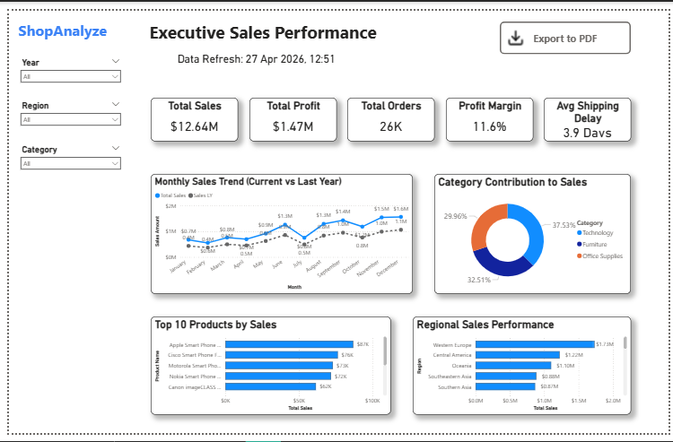

# 🛒 Global Ecommerce Sales Analysis

An end-to-end data analytics project demonstrating the process of extracting, analyzing, and visualizing ecommerce sales data to drive business decisions.

## 📋 Project Overview
This project analyzes a global superstore dataset containing over 51,000 records. The goal is to uncover business insights regarding sales trends, profitability, customer behavior, and operational efficiency.

The project is divided into three main phases:
1. **Data Cleaning & Preparation**: Using Python to sanitize the raw data.
2. **Exploratory Data Analysis (EDA)**: Using SQL to answer critical business questions.
3. **Data Visualization**: Building an interactive, executive-level Power BI dashboard.

## 🗂️ Project Structure
```text
Ecommerce-Sales-Analysis/
├── dataset/         # Raw and cleaned data files (CSV/Excel)
├── powerbi/         # .pbix source file and exported PDF report
├── python/          # Scripts used for data cleaning and prep
├── screenshots/     # Images of SQL query results and Power BI views
│   ├── sql_analysis/
│   └── powerbi_dashboard/
└── sql/             # SQL scripts for table creation and analysis
```

## 🛠️ Tools & Technologies Used
- **Python**: Data Cleaning & Scripting (`pandas`)
- **MySQL**: Database Management & Complex Querying
- **Power BI**: Data Modeling, DAX, and Interactive Dashboard Design

## 📊 Key Business Insights (SQL)
The `sql/analysis_queries.sql` file contains 11 advanced queries answering questions such as:
*   What is the **Year-over-Year (YoY) Sales Growth**?
*   Which are the **Top 10 most profitable customers**?
*   What is the **Profit Margin** breakdown by product sub-category?
*   How do **Shipping Delays** vary across different shipping modes?

*Example:*


## 📈 Power BI Executive Dashboard
The Power BI dashboard translates the raw data into actionable insights for stakeholders, utilizing a professional, modern layout.

**Key Features:**
*   **Executive KPIs**: High-level metrics for Total Sales, Profit, Orders, Margin, and Average Shipping Delay.
*   **Interactive Slicers**: Filter the entire report by Year, Region, and Product Category.
*   **Performance Tracking**: A YoY comparative line chart to track monthly sales momentum.
*   **Deep Dives**: Donut and Bar charts highlighting category contribution and top-performing products.

### Dashboard Preview


## 🚀 How to Use This Repository
1. **Database Setup**: Import `dataset/superstore_orders_cleaned.csv` into your SQL environment or run the provided Python scripts.
2. **SQL Analysis**: Execute the queries in the `sql/` folder to replicate the data extraction process.
3. **Dashboard Viewing**: Open `powerbi/Ecommerce_Sales_Dashboard.pbix` using Power BI Desktop, or view the static `.pdf` export located in the same folder.
