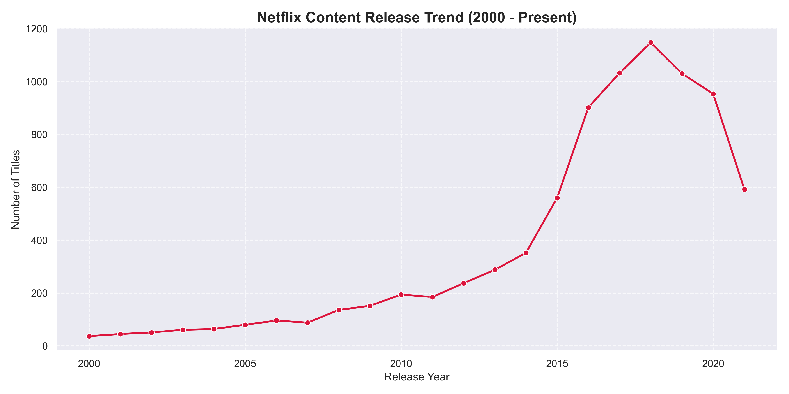

# 🎬 Netflix Data Analysis

An end-to-end Exploratory Data Analysis (EDA) project focused on the Netflix Movies and TV Shows dataset. This project demonstrates data cleaning, exploratory data analysis, and professional data visualization using Python.

## 📋 Project Overview
This project analyzes thousands of Netflix titles to uncover business insights regarding content strategy, genre popularity, regional production, and release trends. 

The project follows a structured data science workflow:
1. **Data Cleaning**: Handling missing values, standardizing dates, and removing duplicates.
2. **Exploratory Data Analysis (EDA)**: Aggregating and segmenting data to extract key metrics.
3. **Data Visualization**: Creating high-quality, professional charts using Matplotlib and Seaborn.

## 🗂️ Project Structure
```text
Netflix-Data-Analysis/
├── dataset/         
│   ├── raw/
│   │   └── netflix_titles.csv    # Raw dataset
│   └── processed/
│       └── netflix_cleaned.csv   # Processed dataset
├── outputs/         
│   └── insights_summary.txt      # Text file containing business insights
├── python/          
│   ├── data_cleaning.py          # Script for missing values and transformations
│   ├── data_analysis.py          # Script for aggregations and metrics
│   ├── visualization.py          # Script generating Matplotlib/Seaborn charts
│   └── netflix_eda.ipynb         # Full Jupyter Notebook combining all steps
├── visuals/         
│   ├── content_type_distribution.png
│   ├── rating_distribution.png
│   ├── top_countries.png
│   ├── top_genres.png
│   └── yearly_release_trend.png
├── requirements.txt              # Required python libraries
└── README.md                     # Professional project documentation
```

## 🛠️ Tools & Technologies Used
- **Python**
- **Pandas** & **NumPy** (Data Manipulation)
- **Matplotlib** & **Seaborn** (Data Visualization)
- **Jupyter Notebook** (Interactive Analysis)

## 📊 Key Business Insights
The analysis revealed several core insights about Netflix's content strategy:
1. **Content Type**: Movies dominate the Netflix catalog, making up roughly 70% of the content compared to TV Shows.
2. **Top Genres**: International Movies, Dramas, and Comedies are the most prominent genres available on the platform.
3. **Release Trends**: Content production increased rapidly after 2015, peaking around 2018-2019.
4. **Top Countries**: The United States and India are by far the largest producers of content available.
5. **Rating Distribution**: `TV-MA` (Mature Audiences) is the most common rating, indicating a strong strategic focus on adult-oriented programming.

*Example Visualization:*


## 🚀 How to Run the Project
1. **Setup**: Install the required libraries using `pip install -r requirements.txt`.
2. **Data Cleaning**: Run `python/data_cleaning.py` to generate the clean dataset.
3. **Data Analysis**: Run `python/data_analysis.py` to generate the text summary in `outputs/`.
4. **Visualizations**: Run `python/visualization.py` to generate the PNG charts in `visuals/`.
5. **Interactive Notebook**: Open `python/netflix_eda.ipynb` in Visual Studio Code (or Jupyter) to view the entire workflow interactively.
