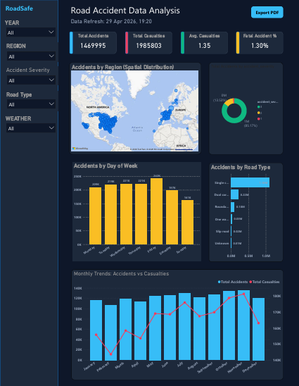

# 🚗 Road Accident Data Analysis

An end-to-end data analytics project exploring road accident data from the UK. This project uses Python for data processing, analysis, and visualization, and includes a Power BI dashboard structure for executive reporting.

## 📋 Project Overview
This project identifies high-risk regions, seasonal accident patterns, and severity trends to provide data-driven safety recommendations.

Key analytical steps:
1. **Data Cleaning**: Standardized columns, handled missing values, and extracted temporal features (month, day of week).
2. **EDA & Analysis**: Analyzed accident frequency by region, severity, and time.
3. **Visualization**: Generated high-impact charts using Seaborn and Matplotlib.
4. **Reporting**: Produced a formal PDF report summarizing the findings.

## 🗂️ Project Structure
```text
Road-Accident-Data-Analysis/
├── dataset/
│   ├── raw/
│   │   └── UK_Accident.csv          # Source UK Accident data
│   └── processed/
│       └── accident_cleaned.csv     # Cleaned data for analysis
├── python/
│   ├── data_cleaning.py             # Data processing script
│   ├── data_analysis.py             # Statistics & insights generation
│   ├── visualization.py             # Chart generation script
│   ├── generate_report.py           # PDF report generator
│   └── accident_eda.ipynb           # Interactive analysis (VS Code ready)
├── visuals/
│   ├── python_charts/               # Charts generated via Python
│   └── powerbi_dashboard/           # Screenshots of the Power BI report
├── outputs/
│   └── insights_summary.txt         # Key business insights
├── reports/
│   └── accident_analysis_report.pdf # Formal summary report
├── powerbi/
│   └── road_accident_dashboard.pbix # Dashboard placeholder
├── requirements.txt
└── README.md
```

## 📊 Key Insights
- **High-Risk Zones**: Specific districts in the UK show a much higher density of accidents.
- **Temporal Patterns**: Accident rates spike during specific months and on weekends (Friday/Saturday).
- **Severity**: Minor accidents are the most common, but Serious/Fatal incidents are clustered in high-speed zones.
- **Casualties**: The average number of casualties per accident is approximately 1.35.

## 🚀 How to Run (VS Code)
1. **Setup**: Install libraries with `pip install -r requirements.txt`.
2. **Execute Pipeline**: Run the scripts in order:
   ```bash
   python python/data_cleaning.py
   python python/data_analysis.py
   python python/visualization.py
   python python/generate_report.py
   ```
3. **Interactive**: Open `python/accident_eda.ipynb` to view the analysis step-by-step.

## 📊 Power BI Instructions
Open the `.pbix` file in the `powerbi/` folder. To load your data:
1. Click **Get Data** > **Text/CSV**.
2. Select `dataset/processed/accident_cleaned.csv`.
3. Create the measures defined in the dashboard requirements (Total Accidents, Total Casualties, etc.).
## 📊 Dashboard & Visualizations

### RoadSafe Executive Dashboard


The Power BI dashboard provides an interactive overview of road safety metrics, allowing users to filter by Year, Region, and Weather conditions to uncover deep insights.
